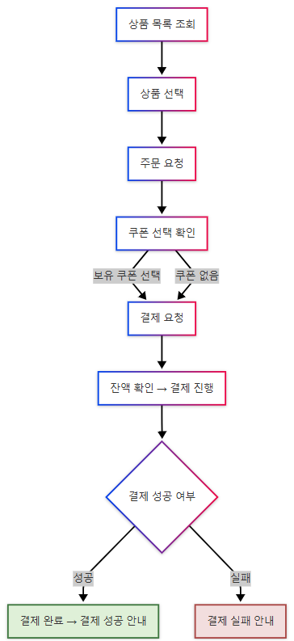
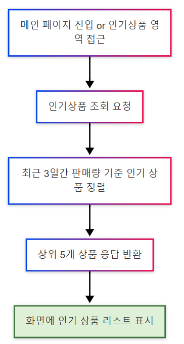

# 🧾 03_Flowchart

## 📌 포인트 충전
사용자가 포인트 충전 페이지에서 원하는 금액을 입력하고 충전 버튼을 누르면,
서버에 충전 요청이 전달됩니다.
요청이 성공하면 사용자 보유 포인트가 증가하고,
실패 시 적절한 안내 메시지가 제공됩니다.

    

---

## 🔁 상품조회 -> 주문 -> 결제
사용자가 상품을 선택하고 쿠폰을 적용한 후, 잔액 확인을 거쳐 결제를 완료하는 흐름입니다.

     주문 -> 결제" width="300"/>

---

## 🎟️ 선착순 쿠폰 발급
사용자가 쿠폰이 없는 경우, 선착순 쿠폰 발급 API를 통해 할인 쿠폰을 요청할 수 있습니다. 발급은 수량 제한이 있기 때문에, 성공 여부에 따라 쿠폰을 발급받거나 실패 안내를 받습니다.

    

---

## 📈 인기 상품 조회
사용자가 인기 상품을 조회하면, 최근 3일간의 판매 데이터를 기반으로
판매량이 높은 상위 5개의 상품을 정렬해 인기 상품 리스트로 표시합니다.

    

---

### * 다이어그램 도구: [mermaidchart.com](https://www.mermaidchart.com/)

#### 📌 포인트 충전

#### 🔁 상품조회 -> 주문 -> 결제

#### 🎟️ 쿠폰 발급

#### 📈 인기 상품 조회
