# 🧾 04_Sequence_Diagrams

## 💰 포인트 조회 API

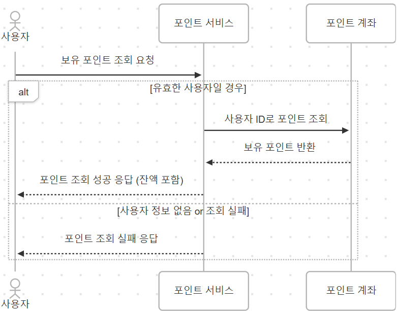

---

## 💰 포인트 충전 API

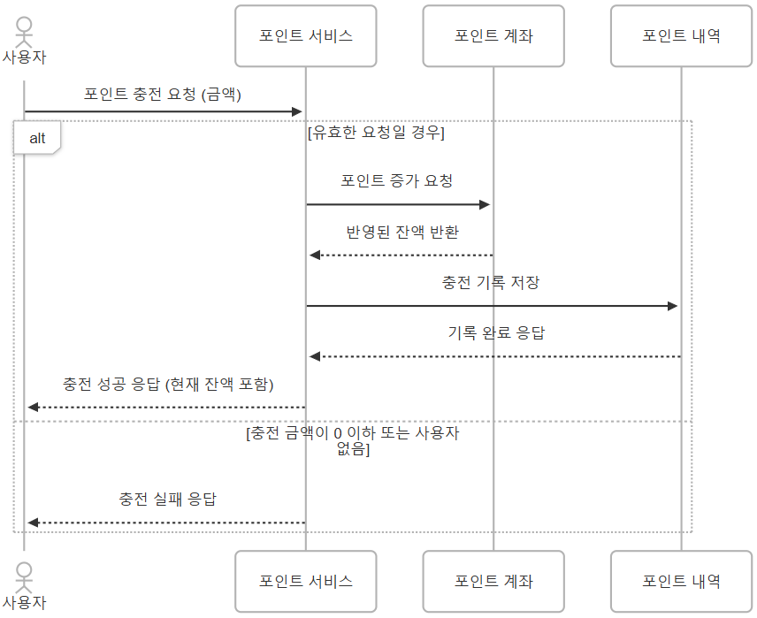

---

## 📦 상품 조회 API

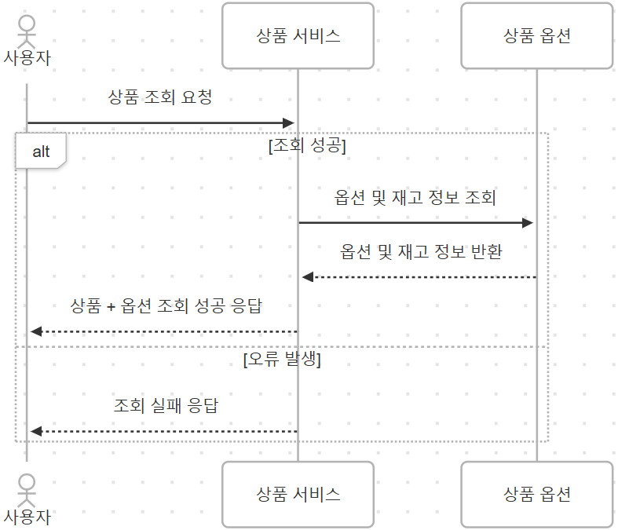

---

## 🔁 주문/결제 API

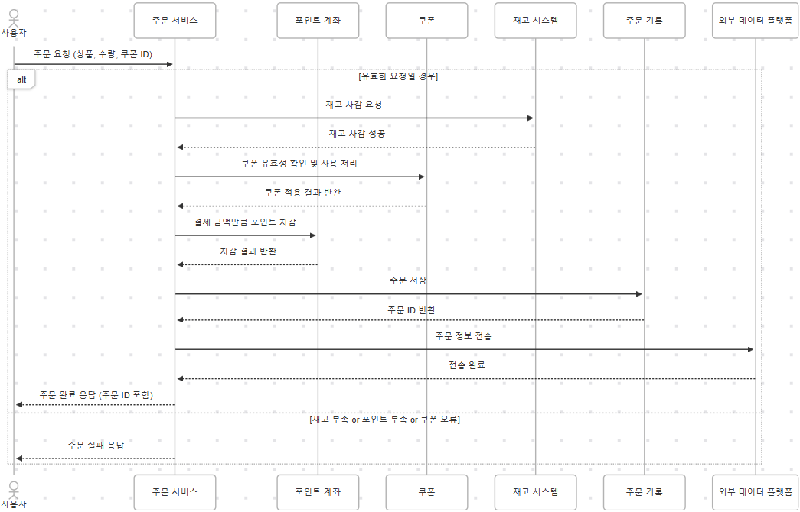

---

## 🎟️ 선착순 쿠폰 발급 API

- 선착순 쿠폰 발급은 다수의 사용자 동시 요청이 들어올 수 있음 
- 👉 재고 차감 시 트랜잭션 & 락 처리 같은 동시성 제어 중요 !

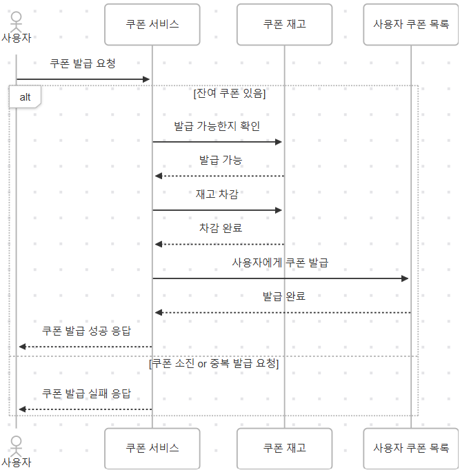

---

## 📈 인기 상품 조회 API

### ✅ 배치로 사전 집계 → 통계 테이블에 저장 → API는 그 테이블만 조회

1. 🔄 배치 프로세스: 주기적으로 데이터를 조회하여 인기 상품을 집계
2. 📈 통계 테이블: 집계된 인기 상품 정보를 저장
3. ⚡ API 요청: 사용자 요청 시, 이미 계산된 통계 테이블에서 바로 응답

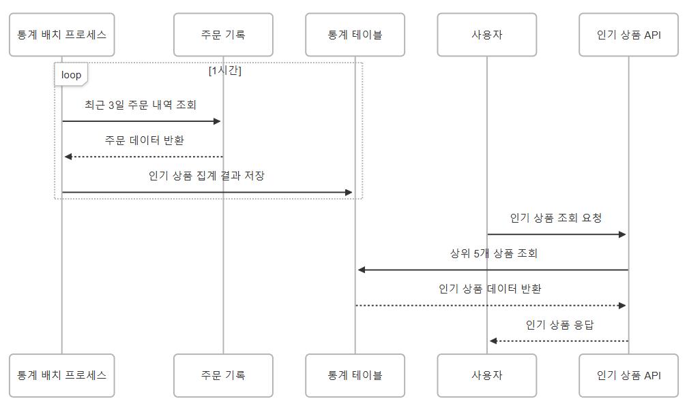

 

---

### * 다이어그램 도구: [mermaidchart.com](https://www.mermaidchart.com/)

#### 💰 포인트 조회 API

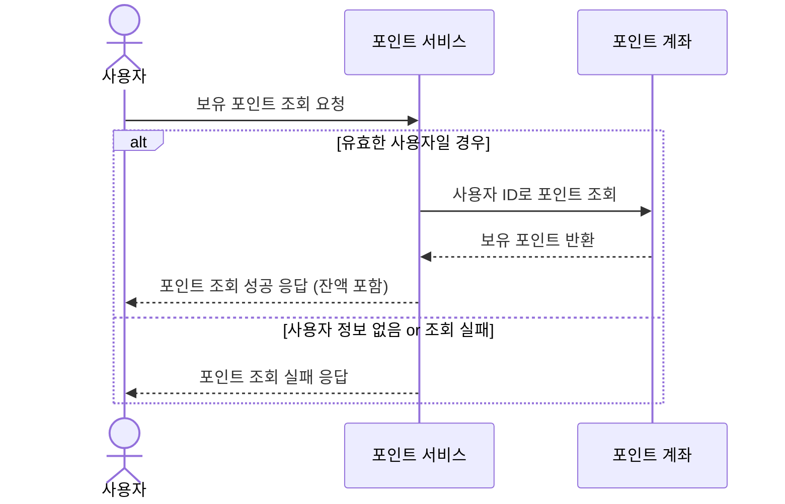

#### 💰 포인트 충전 API

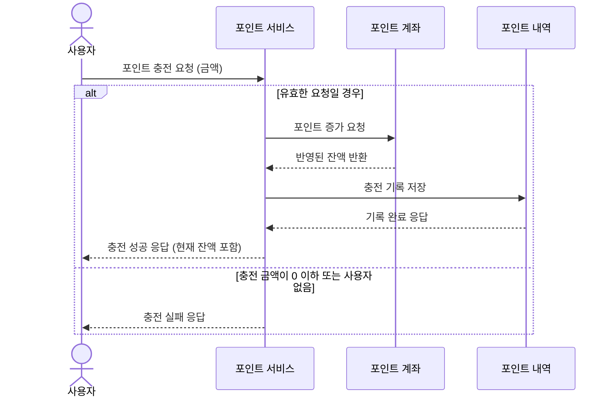

#### 📦 상품 조회 API
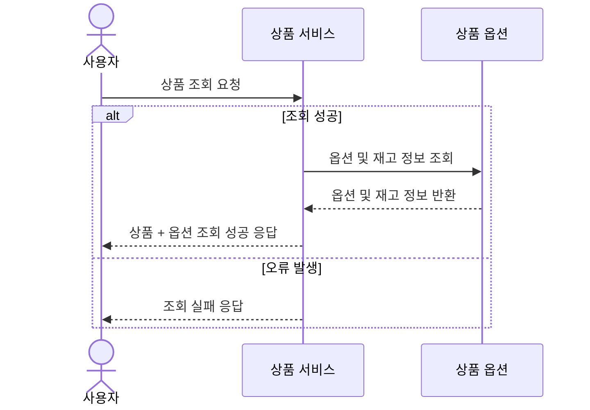

#### 🔁 주문/결제 API
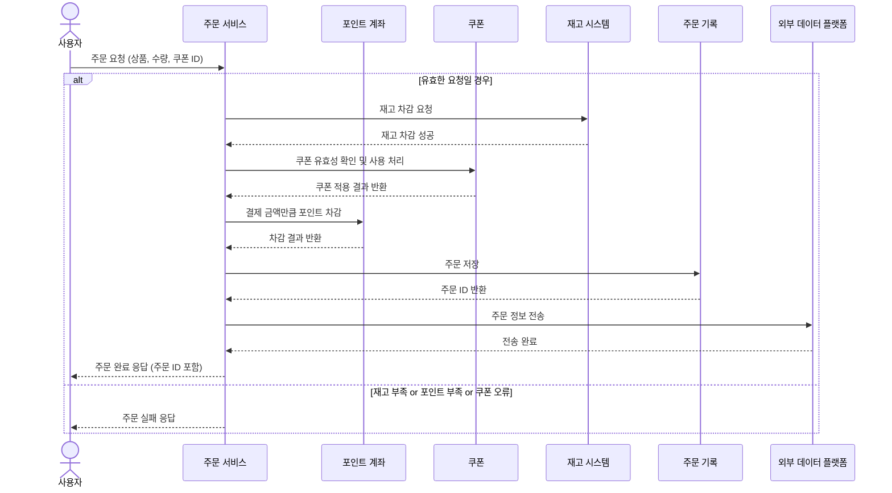

#### 🎟️ 선착순 쿠폰 발급 API
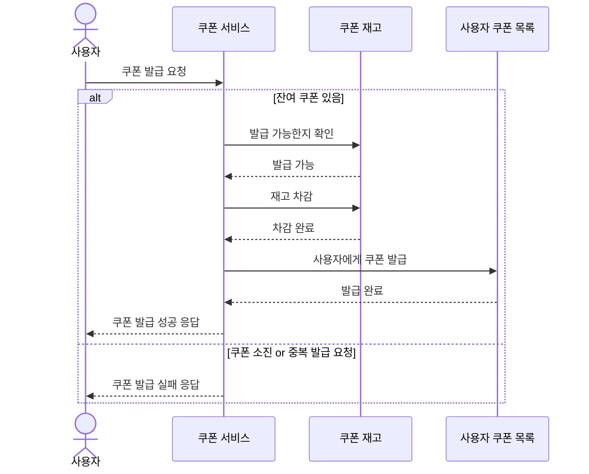

#### 📈 인기 상품 조회 API
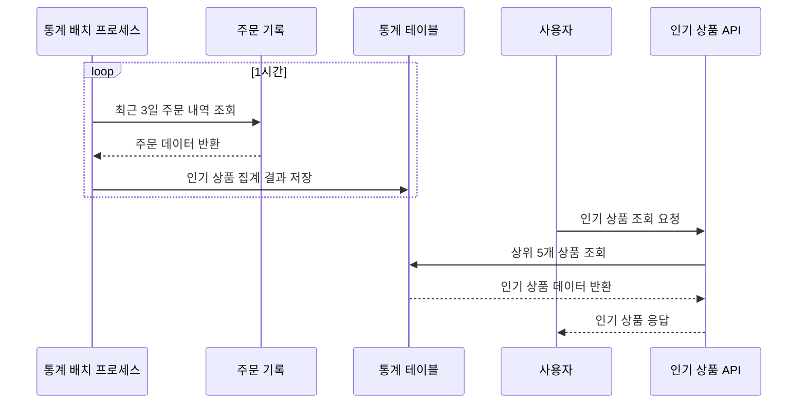