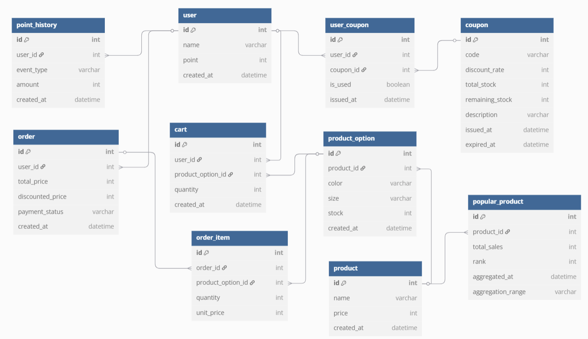

# 🧾 03_ERD



---

## 🗂️ ERD 테이블 설명

> ✅ 본 문서는 e-commerce 프로젝트의 ERD 스키마에 대한 설명입니다. 모든 테이블은 단수형 명명 규칙을 따릅니다.


### 👤 user (사용자)

| 컬럼명      | 타입      | 설명             |
|-------------|-----------|------------------|
| id          | int       | 사용자 ID (PK)   |
| name        | varchar   | 사용자 이름      |
| point       | int       | 보유 포인트      |
| created_at  | datetime  | 가입 시각        |

---

### 🎟️ coupon (쿠폰)

| 컬럼명            | 타입      | 설명         |
|----------------|-----------|------------|
| id             | int       | 쿠폰 ID (PK) |
| code           | varchar   | 쿠폰 코드      |
| discount_rate  | int       | 할인 비율 (%)  |
| total_stock    | int       | 총 발급 가능 수량 |
| remaining_stock| int       | 남은 수량      |
| description    | varchar   | 상세 설명      |
| issued_at      | datetime  | 발급 시작일     |
| expired_at     | datetime  | 유효 만료일     |

---

### 🎫 user_coupon (사용자 보유 쿠폰)

| 컬럼명     | 타입      | 설명                                 |
|------------|-----------|--------------------------------------|
| id         | int       | 보유 쿠폰 ID (PK)                    |
| user_id    | int       | 사용자 ID (user 참조)               |
| coupon_id  | int       | 쿠폰 ID (coupon 참조)               |
| is_used    | boolean   | 사용 여부                            |
| issued_at  | datetime  | 사용자에게 발급된 시각              |

---

### 💰 point_history (포인트 이력)

| 컬럼명       | 타입      | 설명                       |
|--------------|-----------|--------------------------|
| id           | int       | 포인트 이력 ID (PK)           |
| user_id      | int       | 사용자 ID (user 참조)         |
| event_type   | varchar   | 이벤트 종류 (`CHARGE`, `USE`) |
| amount       | int       | 금액                       |
| created_at   | datetime  | 발생 시각                    |

---

### 📦 product (상품)

| 컬럼명      | 타입      | 설명           |
|-------------|-----------|----------------|
| id          | int       | 상품 ID (PK)   |
| name        | varchar   | 상품 이름      |
| price       | int       | 기본 가격      |
| created_at  | datetime  | 등록일         |

---

### 🎨 product_option (상품 옵션)

| 컬럼명        | 타입      | 설명                 |
|---------------|-----------|--------------------|
| id            | int       | 상품 옵션 ID (PK)      |
| product_id    | int       | 상품 ID (product 참조) |
| color         | varchar   | 색상                 |
| size          | varchar   | 사이즈                |
| stock         | int       | 재고 수량              |
| created_at    | datetime  | 등록일                |

---

### 🛒 cart (장바구니)

| 컬럼명             | 타입      | 설명                                       |
|--------------------|-----------|--------------------------------------------|
| id                 | int       | 장바구니 ID (PK)                       |
| user_id            | int       | 사용자 ID (`user` 테이블 참조)             |
| product_option_id  | int       | 상품 옵션 ID (`product_option` 테이블 참조) |
| quantity           | int       | 담은 수량                                  |
| created_at         | datetime  | 장바구니에 담은 시각                        |

---


### 🧾 order (주문)

| 컬럼명              | 타입       | 설명                                      |
|------------------|----------|-----------------------------------------|
| id               | int      | 주문 ID (PK)                              |
| user_id          | int      | 사용자 ID (user 참조)                        |
| total_price      | int      | 총 주문 금액                                 |
| discounted_price | int      | 할인 적용 결제 금액                             |
| payment_status   | varchar  | 결제 상태 (PENDING, PAID, FAILED, CANCELED) |
| created_at       | datetime | 주문 시각                                   |

---

### 📄 order_item (주문 상세)

| 컬럼명            | 타입      | 설명                           |
|-------------------|-----------|------------------------------|
| id                | int       | 주문 상세 ID (PK)                |
| order_id          | int       | 주문 ID (order 참조)             |
| product_option_id | int       | 상품 옵션 ID (product_option 참조) |
| quantity          | int       | 수량                           |
| unit_price        | int       | 단가                           |

---

### 📊 popular_product (인기 상품 통계)

| 컬럼명            | 타입       | 설명                                   |
|-------------------|------------|--------------------------------------|
| id                | int        | 인기 상품 통계 ID (PK)                     |
| product_id        | int        | 인기 상품 ID (`product` 테이블 참조)          |
| total_sales       | int        | 최근 집계 기간 동안의 총 판매 수량 (주문 건수X)        |
| rank              | int        | 인기 순위 (1위~5위 등)                      |
| aggregated_at     | datetime   | 통계 집계 시각                             |
| aggregation_range | varchar    | 집계 기준 기간 (ex: `'3d'`, `'24h'` 등 문자열) |

---


### * 다이어그램 도구: [https://dbdiagram.io/](https://dbdiagram.io/)
```
Table user {
  id int [pk, increment] // 사용자 ID
  name varchar // 사용자 이름
  point int // 현재 보유 포인트
  created_at datetime // 가입일
}

Table coupon {
  id int [pk, increment] // 쿠폰 ID
  code varchar // 쿠폰 코드
  discount_rate int // 할인 비율 (%)
  total_stock int // 총 발급 가능한 수량
  remaining_stock int // 남아있는 수량
  description varchar // 상세 설명
  issued_at datetime // 발급 시작일
  expired_at datetime // 유효 만료일
}

Table user_coupon {
  id int [pk, increment] // 보유 쿠폰 ID
  user_id int [ref: > user.id] // 사용자 ID
  coupon_id int [ref: > coupon.id] // 쿠폰 ID
  is_used boolean // 사용 여부
  issued_at datetime // 발급 시각
}

Table point_history {
  id int [pk, increment] // 포인트 기록 ID
  user_id int [ref: > user.id] // 사용자 ID
  event_type varchar // CHARGE or USE
  amount int // 금액
  created_at datetime // 발생 시각
}

Table product {
  id int [pk, increment] // 상품 ID
  name varchar // 상품 이름
  price int // 기본 가격
  created_at datetime // 등록일
}

Table product_option {
  id int [pk, increment] // 옵션 ID
  product_id int [ref: > product.id] // 연결된 상품 ID
  color varchar // 색상
  size varchar // 사이즈
  stock int // 재고 수량
  created_at datetime // 등록일
}

Table cart {
  id int [pk, increment] // 장바구니 항목 ID
  user_id int [ref: > user.id] // 사용자 ID
  product_option_id int [ref: > product_option.id] // 담은 옵션 ID
  quantity int // 수량
  created_at datetime // 담은 시각
}

Table order {
  id int [pk, increment] // 주문 ID
  user_id int [ref: > user.id] // 주문자 ID
  total_price int // 주문 총액
  discounted_price int // 할인 적용 금액
  created_at datetime // 주문 시각
}

Table order_item {
  id int [pk, increment] // 주문상품 ID
  order_id int [ref: > order.id] // 주문 ID
  product_option_id int [ref: > product_option.id] // 선택된 옵션 ID
  quantity int // 수량
  unit_price int // 단가
}

Table popular_product {
  id int [pk, increment] // 고유 ID
  product_id int [ref: > product.id] // 인기 상품 ID
  total_sales int // 최근 3일간 총 판매 수량
  rank int // 판매 순위
  aggregated_at datetime // 집계 시각
  aggregation_range varchar // 집계 기간 (예: '3d', '7d', '24h')
}
```